<h1>Testing website and API performance with JMeter</h1>
<p align="center">
  <a href="https://jmeter.apache.org/">
    
  </a>
</p>

# I. Giới thiệu về JMeter.
jMeter là một công cụ mã nguồn mở được sử dụng để kiểm tra hiệu suất và thử nghiệm chức năng của ứng dụng web. Được phát triển bởi Apache Software Foundation, jMeter cung cấp khả năng tạo và thực thi các kịch bản kiểm tra với số lượng lớn người dùng ảo, đo lường thời gian phản hồi, xử lý tải trọng và đánh giá hiệu suất của trang web hoặc ứng dụng. Công cụ này được sử dụng rộng rãi trong quy trình kiểm tra hiệu suất và tải của ứng dụng web để đảm bảo rằng hệ thống có thể đáp ứng được số lượng lớn người dùng và hoạt động một cách ổn định.
# II. Kiểm thử hiệu năng của trang web.
<b>Mục tiêu của quá trình kiểm tra là:</b>
- Đánh giá thời gian phản hồi trung bình của trang web.
- Xác định số lượng yêu cầu thành công và thất bại.
- Đo lường thời gian tải trung bình của trang web.
- Phân tích thông tin về lưu lượng và kích thước dữ liệu.

<b>Phương pháp kiểm tra:</b>
- Kiểm tra hiệu suất được thực hiện bằng cách sử dụng công cụ Meter để tạo kịch bản mô phỏng người dùng truy cập trang web. Dữ liệu kiểm tra được thu thập và phân tích dựa trên các thông tin từ Summary Report và Graph Results của jMeter.
## 1.1. Thực hiện.

Trang web chúng tôi thực hiện kiểm thử hiệu năng với JMeter lần này là trang web của một trường đại học, địa chỉ trang web đó là `https://phenikaa-uni.edu.vn/vi`.
Chi tiết các thiết lập cho bài kiểm thử này với JMeter:
- Tạo Thread Group với số users là 10 người, khoảng thời gian chờ giữa các request là 10s, số lần lặp là 10 vòng. Ảnh của thiết lập:
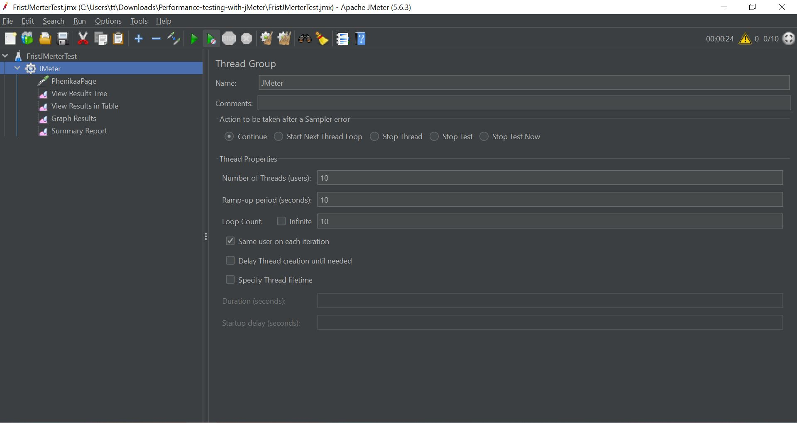
- Bước tiếp theo là tạo HTTP Request, Server Name or IP: `phenikaa-uni.edu.vn`, path: `/vi`, phương thức `GET`. Ảnh minh họa: 
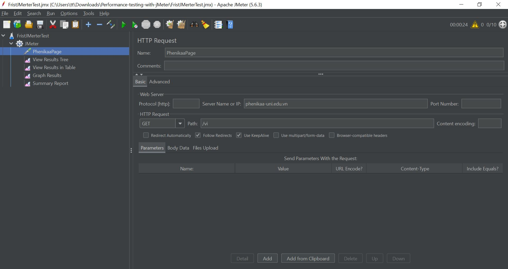
Đã xong các thiết lập giờ chúng ta sẽ thực hiện chạy để kiểm thử hiệu năng của trang web này.
## 1.2. Kết quả kiểm thử.
<b>Thời gian phản hồi trung bình (Average Response Time):</b>
- Trong quá trình kiểm tra, thời gian phản hồi trung bình của trang web là 1612 milliseconds, với thời gian phản hồi tối thiểu (Min) là 562 milliseconds và thời gian phản hồi tối đa (Max) là 2837 milliseconds. Độ lệch chuẩn (Standard Deviation) của thời gian phản hồi là 566.10 milliseconds.
  
<b>Số lượng yêu cầu thành công và thất bại:</b>
- Trong tổng số 100 yêu cầu được gửi đi, không có yêu cầu nào gặp lỗi, tỷ lệ lỗi là 0%.
 
<b>Thông tin về thời gian tải trang:</b>
- Trang web có thời gian tải trung bình là 1612 milliseconds, với thời gian tải trang trung vị (Median) là 1515 milliseconds.
  
<b>Thống kê về lưu lượng và kích thước dữ liệu:</b>
- Lưu lượng dữ liệu nhận được trên giây (Received KB/sec) là 6357.76 KB/sec, và dữ liệu gửi đi (Send KB/sec) là 0.96 KB/sec.
- Trung bình kích thước byte (Avg. Byte) của các yêu cầu là 1572508.91 bytes.

<b>Những thống kê khác:</b>
- Số lượng mẫu (No of samples) là 100, với độ lệch chuẩn (Deviation) của thời gian phản hồi là 566 milliseconds.
- Mẫu cuối cùng (Latest Sample) có thời gian phản hồi là 562 milliseconds.
- Tốc độ thực hiện yêu cầu (Throughtput) đạt 248.406 yêu cầu trên phút, và thời gian trung bình giữa các yêu cầu (Average) là 1612 milliseconds. Thời gian phản hồi trung vị (Median) của các mẫu là 1515 milliseconds.
  
<b>Đánh giá tổng thể về hiệu suất:</b>
- Dựa trên các thông số như thời gian phản hồi và thời gian tải trang, trang web có thể được đánh giá là đáp ứng tốt với yêu cầu hiệu suất đã đặt ra.
Không có yêu cầu nào gặp lỗi trong quá trình kiểm tra, cho thấy trang web hoạt động ổn định và không có vấn đề đáng ngại.

Ảnh kết quả:
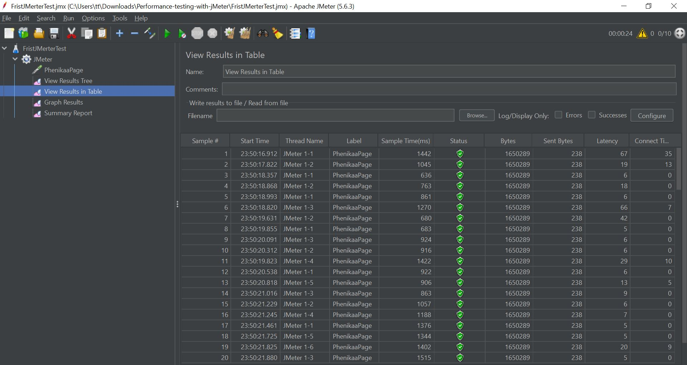
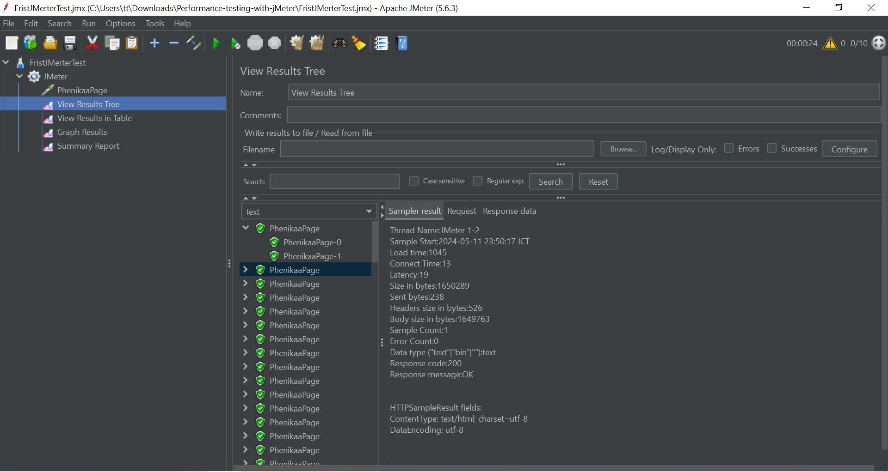
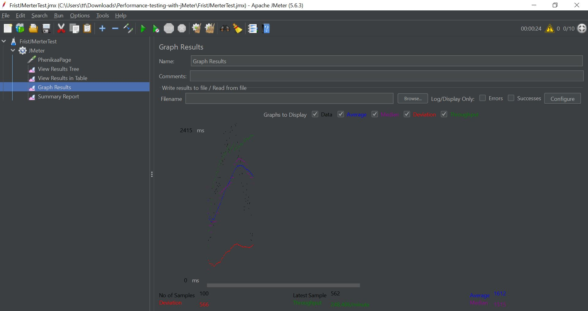
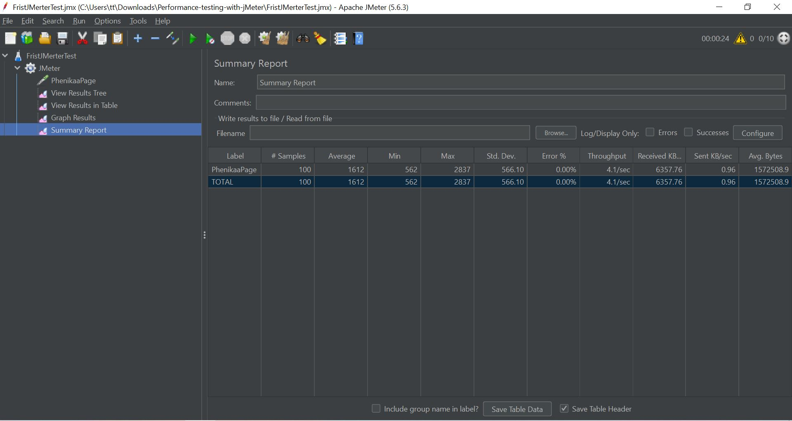

# III. So sánh hiệu năng của hai trang web.
Hai trang web được chúng tôi chọn để thực hiện so sánh trong bài kiểm thử này là Phenikaa University và HUST University.
Cả hai trang này đều được thực hiện kiểm thử với users là 75 người, khoảng thời gian chờ giữa các request là 10s, số lần lặp là 10 vòng. 

<b>Kết quả của bài kiểm thử này:</b>
- Phenikaa University:
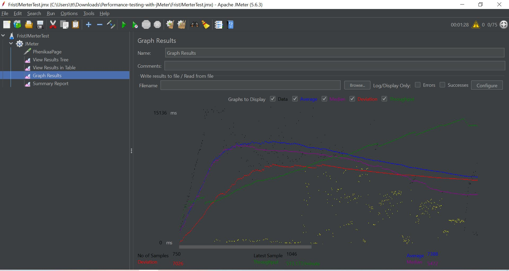
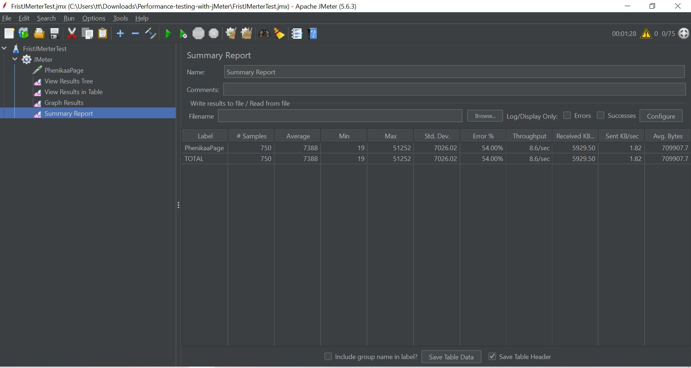

- HUST University:
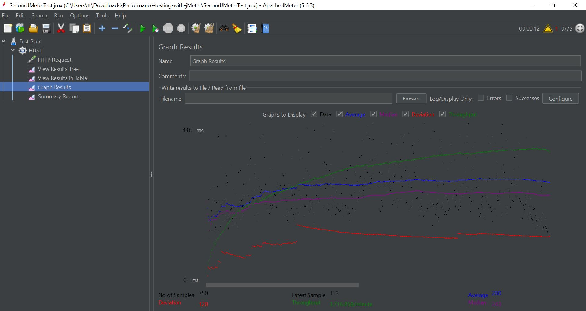
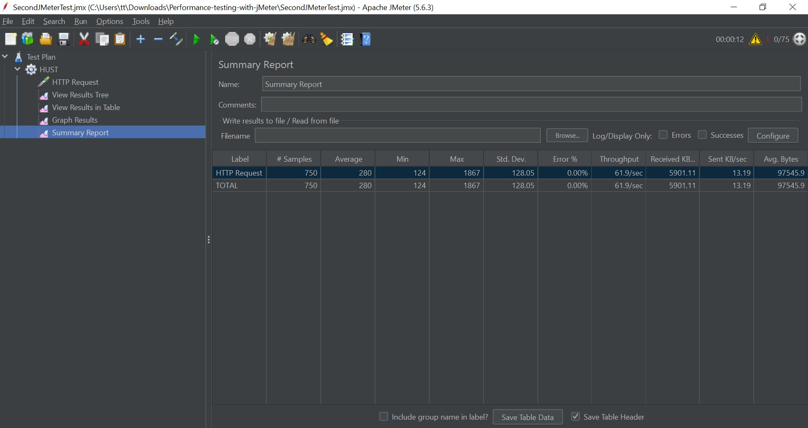
##### Phân tích kết quả kiểm tra hiệu suất:
<p>1. Thời gian phản hồi trung bình (Average Response Time):</p>

- Phenikaa University: Thời gian phản hồi trung bình là 7388 milliseconds, với thời gian phản hồi tối thiểu là 19 milliseconds và thời gian phản hồi tối đa là 51252 milliseconds. Độ lệch chuẩn của thời gian phản hồi là 7026.02 milliseconds.
- HUST University: Thời gian phản hồi trung bình là 280 milliseconds, với thời gian phản hồi tối thiểu là 124 milliseconds và thời gian phản hồi tối đa là 1867 milliseconds. Độ lệch chuẩn của thời gian phản hồi là 128.05 milliseconds.
  
<b> Kết luận </b>: HUST University có thời gian phản hồi trung bình nhanh hơn đáng kể so với Phenikaa University, với chỉ khoảng 280 milliseconds so với 7388 milliseconds của Phenikaa University.

<p>2. Số lượng yêu cầu thành công và thất bại:</p>

- Phenikaa University: Tỷ lệ lỗi là 54%, cho thấy một phần lớn yêu cầu gặp lỗi trong quá trình kiểm tra.
- HUST University: Tỷ lệ lỗi là 0%, cho thấy không có yêu cầu nào gặp lỗi trong quá trình kiểm tra.
  
<b> Kết luận </b>: HUST University có tỷ lệ lỗi thấp hơn và không gặp vấn đề trong quá trình kiểm tra so với Phenikaa University.

<p>3. Thời gian tải trung bình:</p>

- Phenikaa University: Thời gian tải trung bình của trang web là 7388 milliseconds.Thời gian tải trung bình cao, đặc biệt là so với HUST University, có thể làm giảm trải nghiệm người dùng.
- HUST University: Thời gian tải trung bình của trang web là 280 milliseconds.Thời gian tải trung bình thấp, cho thấy trang web có khả năng tải nhanh và cung cấp trải nghiệm tốt hơn cho người dùng.
  
<b> Kết luận </b>: HUST University có thời gian tải trung bình nhanh hơn đáng kể so với Phenikaa University.

<p>4. Thống kê về lưu lượng và kích thước dữ liệu:</p>

- Phenikaa University: Lưu lượng dữ liệu nhận được và gửi đi tương đối cao, tuy nhiên, kích thước byte trung bình của các yêu cầu là khá lớn.
- HUST University: Lưu lượng dữ liệu nhận được và gửi đi thấp hơn Phenikaa University, tuy nhiên, kích thước byte trung bình của các yêu cầu là nhỏ.
  
<b> Kết luận </b>: Tùy thuộc vào yêu cầu cụ thể của dự án hoặc nhu cầu của người dùng cuối, có thể chọn lựa giữa hiệu suất nhanh chóng của HUST University và lưu lượng dữ liệu lớn của Phenikaa University.

<b> Dựa trên phân tích trên, ta có thể rút ra các nhận xét sau: </b>

- Phenikaa University có vấn đề về thời gian phản hồi không đồng đều và tỷ lệ lỗi cao, điều này có thể ảnh hưởng đến trải nghiệm người dùng.
- HUST University có hiệu suất ổn định hơn với thời gian phản hồi và thời gian tải trung bình thấp, cung cấp trải nghiệm tốt hơn cho người dùng.

<p style="color: red"><b>Note:</b> Khi thực hiện so sánh này do hạn chế về thiết bị phần cứng và hạ tầng mạng chúng tôi chỉ thực hiện với 75 users và 10 lần lặp, vì thế nên độ chính xác của kết quả trên có thể không đúng với thực tế mong bạn cân nhắc khi sử dụng kết quả này. </p>

# IV. Thực hiểm kiểm thử hiệu năng của API.
Phần cuối của báo cáo này chúng tôi thực hiểm kiểm thử hiệu năng của một API với JMeter.
API mà chúng tôi chọn để thực hiện là `https://reqres.in/api`
## 1.1. Thực hiện.
- Tương tự như với web, chúng ta cũng sẽ tạo Thread Group. Ảnh thiết lập: 
  
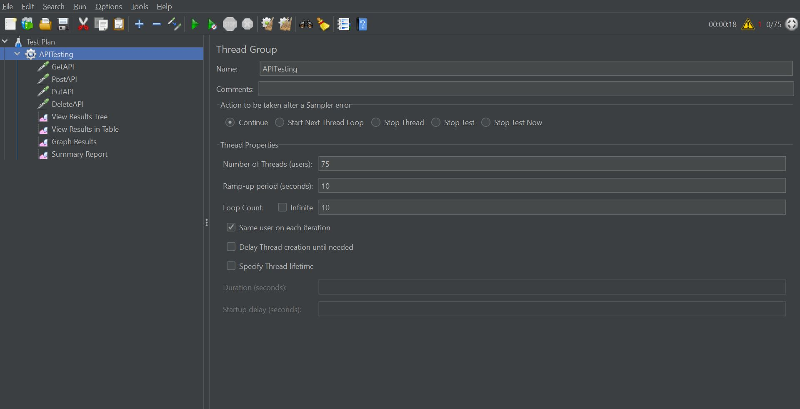
- Tạo http request, thực hiện kiểm thử với phương thức GET với API trên.
  
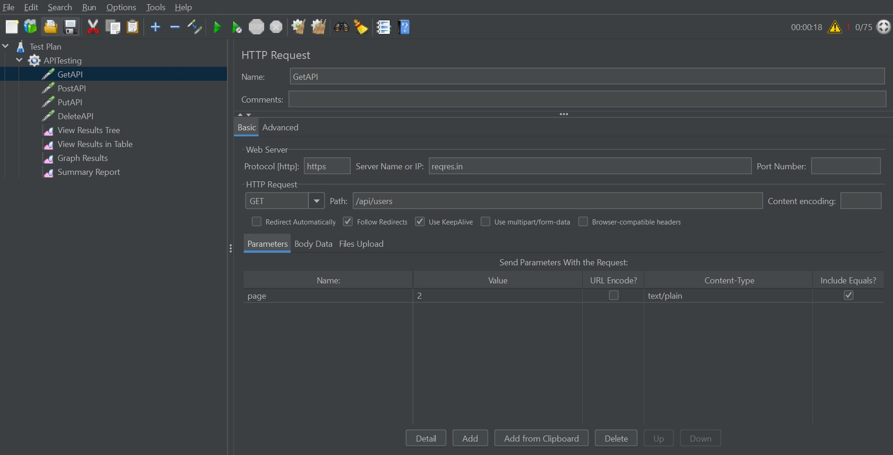
- Tạo http request, thực hiện kiểm thử với phương thức POST với API trên, dữ liệu được gửi kèm request là 
```
{
    "name": "morpheus",
    "job": "leader"
}
```
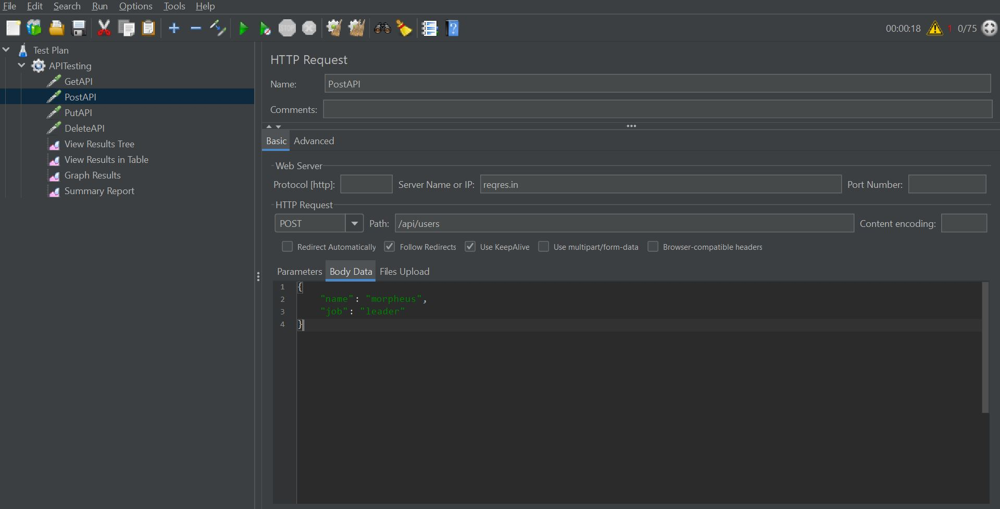
- Tạo http request, thực hiện kiểm thử với phương thức PUT với API trên, dữ liệu được gửi kèm request là 
```
{
    "name": "morpheus",
    "job": "zion resident"
}
```
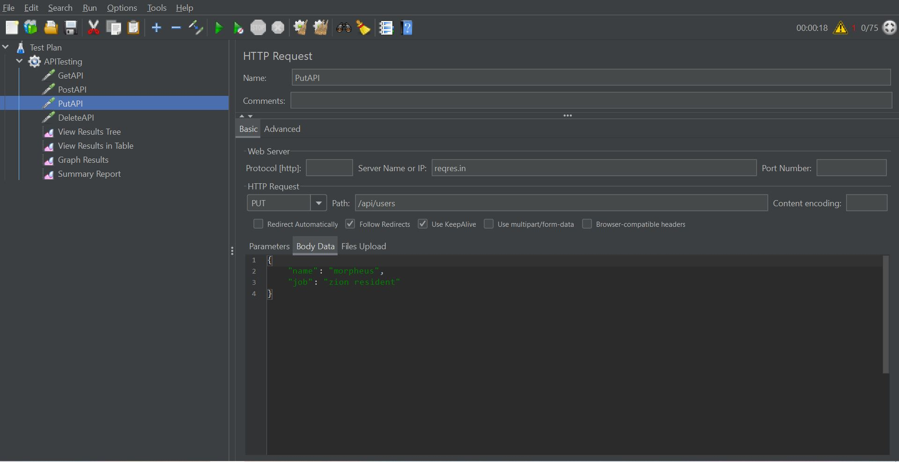
- Cuối cùng tạo http request, thực hiện kiểm thử với phương thức DELETE với API trên.
  
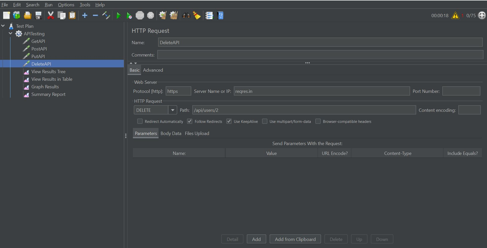
## 1.2. Kết quả kiểm thử.
Nhìn chung, các API RESTful được kiểm thử có hiệu suất tốt. Tất cả các API đều có thời gian phản hồi trung bình dưới 1 giây và tỷ lệ lỗi là 0%. Tuy nhiên, có một số điểm cần lưu ý:
- GetAPI có thời gian phản hồi trung bình thấp nhất, nhưng độ lệch chuẩn cao nhất. Điều này cho thấy rằng GetAPI có thể có hiệu suất không ổn định.
- PutAPI có thời gian phản hồi trung bình thấp thứ hai, nhưng độ lệch chuẩn thấp nhất. Điều này cho thấy rằng PutAPI có hiệu suất ổn định nhất.
- DeleteAPI có thời gian phản hồi trung bình cao nhất, nhưng độ lệch chuẩn thấp thứ hai. Điều này cho thấy rằng DeleteAPI có thể có hiệu suất ổn định, nhưng chậm hơn các API khác.

<b>Chi tiết về kết quả kiểm thử:</b>

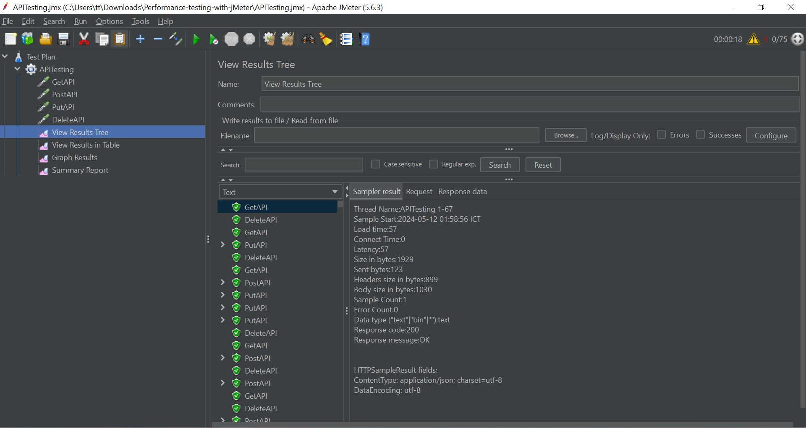
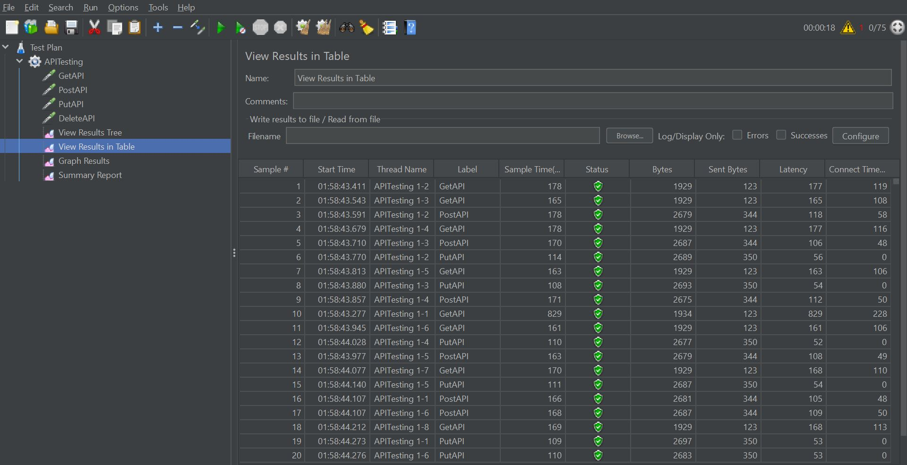
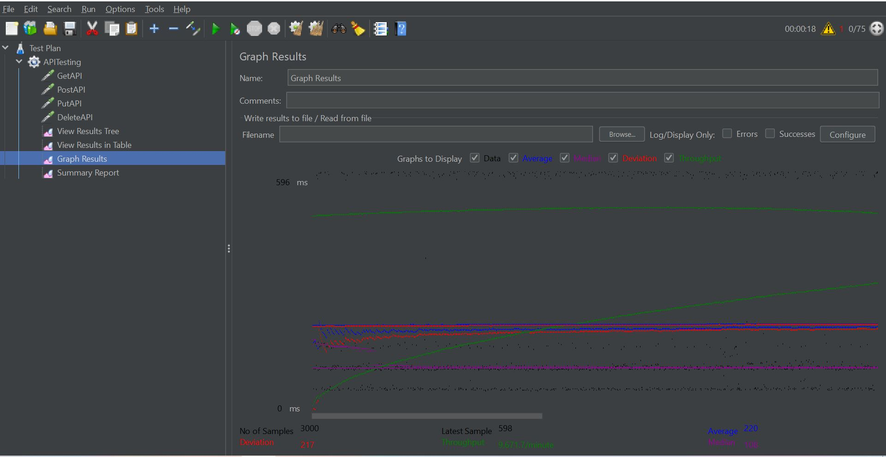
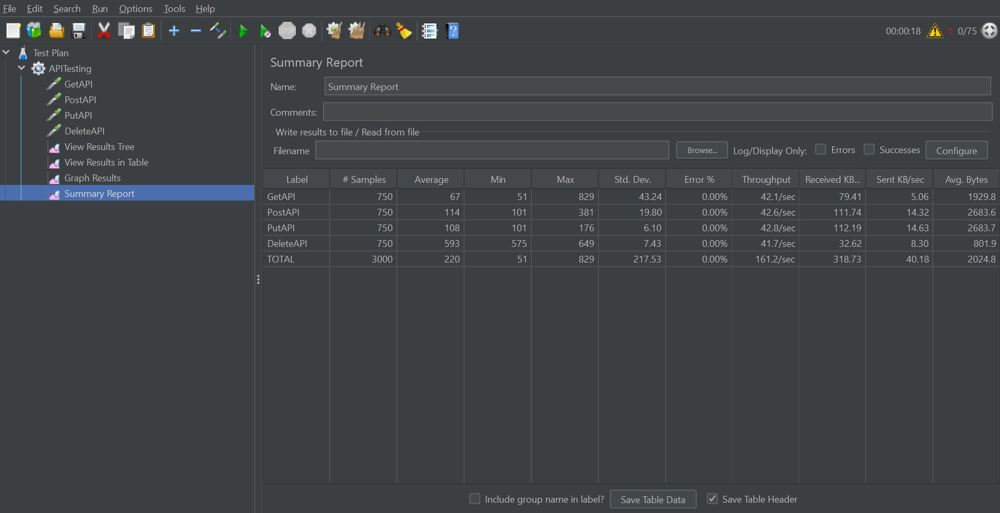
